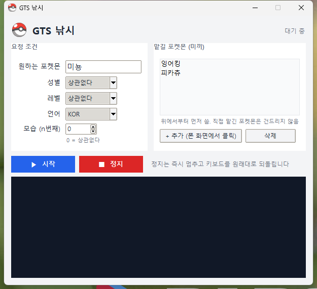

# GTS 낚시 (GtsFishing)

포켓몬 HOME 모바일 GTS에 미끼 포켓몬을 맡겨 두고, 나눔 봇(열차)이 물어 갈 때까지 자동으로 회수·재등록을 반복하는 Windows 프로그램입니다. 폰 화면을 캡처해 버튼을 찾고 눌러 주는 방식이라 폰의 루팅이나 앱 수정이 없습니다.

> ⚠️ 이 프로그램은 포켓몬 HOME 이용약관이 금지하는 비인가 도구에 해당합니다. 계정 정지 등 모든 불이익은 사용자 책임입니다.

## 준비물

| 항목 | 내용 |
|---|---|
| PC | Windows 10/11 |
| 폰 | Android, **화면 1080 x 2520** 권장 (갤럭시 Z 플립7에서 개발·검증). 다른 해상도는 비례 보정을 하지만 검증되지 않았습니다 |
| 앱 | 포켓몬 HOME **한국어**. 프리미엄이면 3자리, 기본 플랜이면 1자리로 돌아갑니다 |
| 연결 | USB 케이블, 개발자 옵션의 **USB 디버깅** 켜기 |

adb와 한글 입력용 ADBKeyboard는 프로그램에 들어 있어 따로 설치할 것이 없습니다. 첫 실행 때 폰에 ADBKeyboard가 자동 설치되며, 봇이 도는 동안만 그 키보드를 쓰고 끝나면 원래 키보드로 되돌립니다.

## 설치

1. [릴리즈](../../releases)에서 zip을 받아 아무 폴더에 풉니다. `GtsFishing.exe`, `config.json`, `templates/` 세 개가 한 폴더에 있어야 합니다.
2. 폰에서 **설정 → 휴대전화 정보 → 소프트웨어 정보 → 빌드번호 7회 탭** → 개발자 옵션 → **USB 디버깅** 켜기.
3. 케이블을 꽂고 "USB 디버깅을 허용하시겠습니까?"에서 **이 컴퓨터에서 항상 허용**을 체크한 뒤 허용.
4. 개발자 옵션의 **충전 중 화면 켜짐 유지**도 켜 두면 화면이 꺼져 멈추는 일이 없습니다.
5. 처음 실행 시 Windows SmartScreen 경고가 뜨면 "추가 정보 → 실행"을 누릅니다. 서명 없는 개인 빌드라 나오는 경고입니다.

## 사용법

1. **폰에서 포켓몬 HOME을 켜고 교환 → GTS 화면까지 들어갑니다.** 다른 화면에 있어도 프로그램이 앱을 재시작해 GTS로 찾아가지만, 처음엔 직접 들어가 두는 편이 빠릅니다.
2. **원하는 포켓몬**에 열차가 나눠주는 포켓몬 이름을 한글로 적습니다. (예: 고릴타)
3. 성별·레벨·언어·모습은 필요할 때만 고릅니다. 열차 운영자가 KOR 요청만 골라 주는 경우가 있어 **언어 KOR**을 거는 것이 유리할 때가 있습니다.
   - **GTS 자리 수**는 자기 플랜에 맞게 고릅니다. 프리미엄이 아니면 **1**로 두세요. 3으로 두면 없는 받침대를 누르다 엉뚱한 버튼을 건드릴 수 있습니다.
4. **+ 추가 (폰 화면에서 클릭)** 를 누르면 폰의 맡기기 목록이 창에 뜹니다. 미끼로 쓸 포켓몬 아이콘을 클릭하고 이름을 붙이면 등록됩니다. 여러 개를 이어서 고른 뒤 **완료**를 누릅니다.
   - 이로치·전설 등 아까운 포켓몬은 고르지 마세요. 미끼는 열차에 넘어갑니다.
   - 이미 GTS에 맡겨져 배지가 붙은 개체는 피하세요.
5. **▶ 시작**. 아래 로그에 진행 상황이 나옵니다. **■ 정지**는 그 자리에서 바로 멈추고 키보드를 되돌립니다.

## 동작 방식

- 3자리에 미끼를 맡기고, 한 바퀴마다 각 미끼를 **회수 → 재등록**해 요청 목록 상단을 유지합니다. 나눔 봇은 대개 목록 맨 위부터 처리하기 때문입니다.
- 교환이 성립되면 회수 시 "이미 교환된 포켓몬입니다" 안내와 수령 애니메이션이 나옵니다. 프로그램이 이를 감지해 그 미끼를 목록에서 자동으로 지우고, 받은 포켓몬은 상자에 들어갑니다.
- 미끼가 자리 수보다 적으면 있는 것만 돌리고 빈 자리는 그냥 둡니다. 직접 맡긴 포켓몬은 봇이 맡긴 것으로 식별되지 않으므로 손대지 않습니다.
- 앱이 튕기거나 타이틀로 돌아가도 스스로 재시작해 GTS까지 복구합니다. 화면이 꺼져 있으면 깨우지만 PIN 잠금은 풀지 못합니다.

## 문제가 생기면

| 증상 | 확인할 것 |
|---|---|
| "폰이 연결되지 않았습니다" | USB 디버깅, 케이블, 폰의 허용 팝업. 다른 adb 프로그램(스크린 미러링 등)이 폰을 잡고 있지 않은지 |
| 버튼을 못 찾고 오류만 반복 | HOME 언어가 한국어인지, 화면 해상도가 1080x2520인지. 다른 해상도면 `templates/`를 그 폰 화면으로 다시 잘라야 합니다 |
| 미끼를 못 찾음 | 상자 목록 **첫 화면**에 보이는 포켓몬만 인식합니다. 상자가 30칸을 넘으면 앞쪽으로 옮기세요 |
| 화면이 꺼져 멈춤 | 충전 중 화면 켜짐 유지, PIN 잠금 해제 |

오류가 나면 `captures/` 폴더에 그 순간의 화면이 저장됩니다. 이슈를 올릴 때 그 파일과 로그 내용을 함께 올려 주세요.

## 배포판 안내

1. 정지와 스트라이크 등 라이센스 위반에 관한 불이익은 온전히 사용자의 몫입니다. 

## 라이선스와 고지

- 이 저장소는 실행 파일과 문서만 제공합니다.
- 동봉된 adb는 Google의 Android SDK Platform-Tools(Apache 2.0), ADBKeyboard는 [senzhk/ADBKeyBoard](https://github.com/senzhk/ADBKeyBoard)입니다.
- Pokémon HOME은 Nintendo / Creatures / GAME FREAK / The Pokémon Company의 저작물이며, 이 프로젝트는 이들과 무관합니다.
